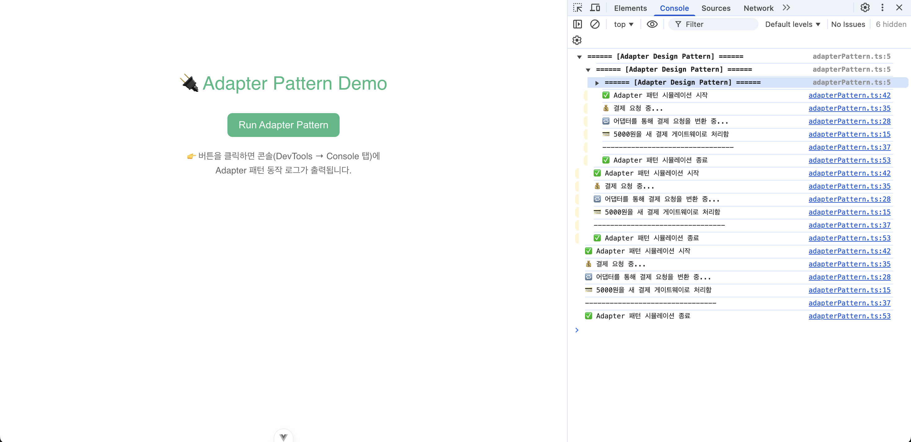
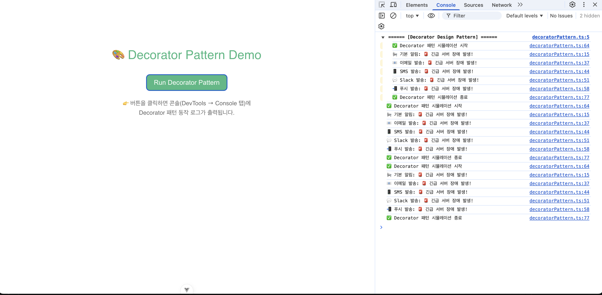
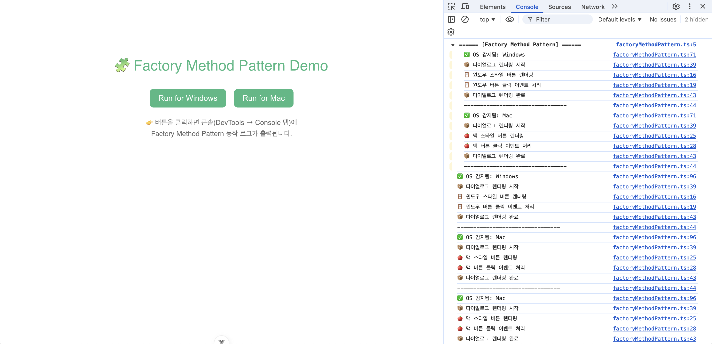
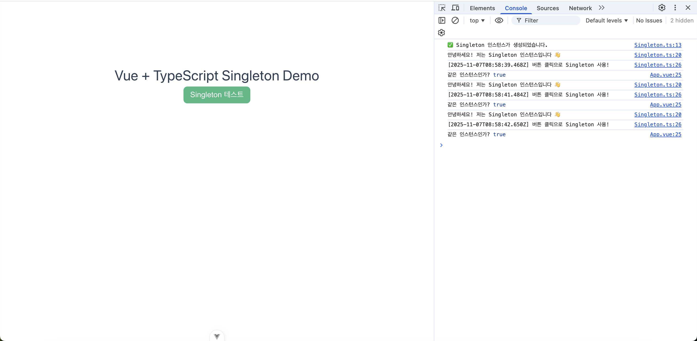
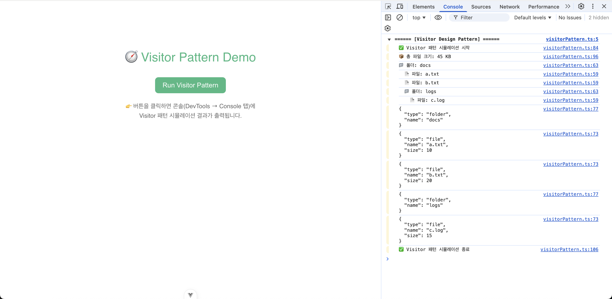

## PB Design Pattern Playground

Vue 3 + TypeScript + Vite 예제로 대표적인 GoF 패턴 6종을 한 곳에서 실험해볼 수 있는 레포지토리입니다. 각 폴더가 하나의 독립 실행형 프로젝트이므로 원하는 패턴만 골라서 `npm install && npm run dev`로 바로 시뮬레이션할 수 있습니다.

### 폴더 구조 한눈에 보기

| 폴더 | 패턴 | 역할 | 핵심 파일 |
| --- | --- | --- | --- |
| `Adapter/` | Adapter | 구형 결제 인터페이스를 신형 게이트웨이에 맞춰주는 어댑터 샘플 | `src/adapterPattern.ts`, `src/App.vue` |
| `Decorator/` | Decorator | 기본 알림 객체를 이메일·SMS 등으로 감싸 기능을 누적 | `src/decoratorPattern.ts`, `src/App.vue` |
| `FactoryMethod/` | Factory Method | OS 별 버튼을 생성하는 다이얼로그 팩토리 | `src/factoryMethodPattern.ts`, `src/App.vue` |
| `Observer/` | Observer | 주가 변동에 반응하는 디스플레이·알림·그래프 옵저버 | `src/observerPattern.ts`, `src/App.vue` |
| `Singleton/` | Singleton | 전역에서 하나만 존재하는 로거/서비스 예제 | `src/Singleton.ts`, `src/App.vue` |
| `Visitor/` | Visitor | 파일/폴더 트리에 서로 다른 연산(사이즈, 출력, JSON)을 방문자로 분리 | `src/visitorPattern.ts`, `src/App.vue` |
| `image/` | Assets | 각 패턴의 동작 흐름을 시각화한 다이어그램 | `image/*.png` |

### 패턴별 구성 및 흐름

#### Adapter
- **상황**: 기존 시스템은 `OldPaymentProcessor`만 인식하지만 실제 결제는 `NewPaymentGateway`로 이루어져야 함.
- **구성**: `PaymentAdapter`가 신형 게이트웨이를 감싸고 `pay()` 호출을 `makePayment()`로 변환하며, `processPayment()`는 인터페이스에만 의존합니다.
- **결과**: 클라이언트 코드를 손대지 않고 새 결제 모듈을 교체할 수 있습니다.

  

#### Decorator
- **상황**: 알림 채널(이메일, SMS, Slack, Push)을 런타임에 조합해야 함.
- **구성**: `BaseNotifier` 위에 `NotifierDecorator` 계층을 쌓아 각 채널이 기존 메시지를 그대로 전달한 뒤 자신만의 전송을 추가합니다.
- **결과**: 조합 순서에 따라 기능을 쉽게 확장/축소하며 중복 코드를 제거합니다.

  

#### Factory Method
- **상황**: OS 종류에 따라 다른 스타일의 버튼을 만들어야 하는 다이얼로그.
- **구성**: `Dialog` 추상 클래스가 `renderDialog()` 템플릿을 제공하고, `WindowsDialog`·`MacDialog`가 `createButton()`을 구현하여 `WindowsButton` 혹은 `MacButton`을 생성합니다.
- **결과**: 클라이언트는 다이얼로그만 선택하면 내부에서 적합한 버튼이 만들어져 동일한 렌더링 로직을 공유합니다.

  

#### Observer
- **상황**: 주가 변동을 여러 UI 모듈에 동시에 전파해야 함.
- **구성**: `Stock`이 `Subject`로서 옵저버 등록/해제를 관리하고, 가격 변경 시 `notify()`로 `PriceDisplay`, `PriceAlert`, `GraphUpdater`를 호출합니다.
- **결과**: 새로운 화면이나 알림 모듈을 옵저버로 추가하기만 하면 실시간 반응이 가능합니다.

  

#### Singleton
- **상황**: 앱 전체에서 하나만 존재해야 하는 로깅/서비스 객체.
- **구성**: `Singleton.getInstance()`가 최초 한 번만 인스턴스를 만들고, `App.vue`에서 여러 번 호출해도 같은 참조임을 확인합니다.
- **결과**: 전역 상태 관리나 공통 서비스에 일관된 진입점을 제공합니다.

  

#### Visitor
- **상황**: 파일/폴더 트리에 대해 “크기 계산, 이름 출력, JSON 변환”처럼 서로 다른 연산을 추가하고 싶음.
- **구성**: `FileElement`와 `FolderElement`가 `accept(visitor)`를 노출하고, `SizeCalculator`, `NamePrinter`, `JsonPrinter`가 각기 다른 행위를 방문자로 구현합니다.
- **결과**: 데이터 구조를 바꾸지 않고도 새로운 연산을 독립적으로 추가할 수 있습니다.

  

### 실행 방법
1. 원하는 패턴 폴더로 이동합니다.  
   `cd Adapter`
2. 의존성 설치 후 개발 서버 실행  
   `npm install && npm run dev`
3. 브라우저에서 `http://localhost:5173` (Vite 기본 포트)로 접속하고 콘솔을 열어 패턴 로그를 확인하세요.

필요시 각 프로젝트의 `src/*Pattern.ts`를 수정하며 시나리오나 로깅을 자유롭게 바꿀 수 있습니다.
